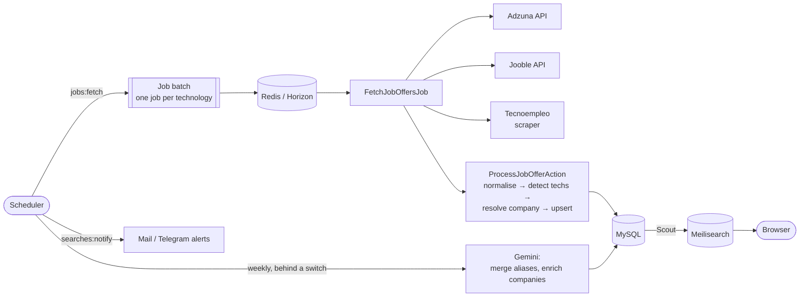

# TuStack

**Which companies in Spain are hiring for your stack?** — [tustack.es](https://tustack.es)

TuStack turns the job market into a directory of companies. Every night it collects tech job
offers from several job boards, detects the technologies each one asks for, and groups them by
employer. You search by technology and province, and instead of a list of ads you get the
companies that actually use that stack, on a map, with their open offers, salary ranges and trends.

It is a personal project that runs in production. It is built with Laravel, a Redis queue, a
nightly scheduled ingestion pipeline, scraping and REST integrations, and an LLM enrichment step
with a hard cost ceiling.

---

## Features

- **Search by stack and province.** Instant, typo-tolerant search over companies (Meilisearch + InstantSearch.js).
- **Company pages** with the aggregated tech stack, open offers, sector, size, website and location.
- **Map** of every company, clustered (Leaflet + OpenStreetMap).
- **Trends and salary insights** per technology over time (Chart.js).
- **SEO landing pages** for every *technology* and *technology × province* combination, with a sitemap and structured data.
- **Saved searches with alerts.** You get an email or a **Telegram** message when a new company matches your filters.
- **Social login** with GitHub and Google.
- **Available in three languages**: Catalan, Spanish and English, with localised routes.
- **Admin panel** (Filament) to manage offers, companies, aliases and technologies, and to review each run's log.
- **Cookieless analytics** (self-hosted Umami), so there is no consent banner. See [`docs/analytics.md`](docs/analytics.md).

## Tech stack

| Layer | Tools |
|---|---|
| Backend | PHP 8.2+, Laravel 12 |
| Queue | Redis, Laravel Horizon, job batches |
| Scheduling | Laravel Scheduler (cron) |
| Data sources | Adzuna API, Jooble API, Tecnoempleo (HTML scraping with Symfony DomCrawler) |
| AI | Google Gemini 2.5 Flash (structured JSON output), Google Translate API |
| Search | Meilisearch via Laravel Scout, InstantSearch.js on the frontend |
| Database | MySQL |
| Frontend | Blade, Tailwind CSS 4, Alpine.js, Vite, Leaflet, Chart.js, Tom Select |
| Admin | Filament 3 |
| Notifications | Resend (mail), Telegram Bot API |
| Auth | Laravel Breeze, Socialite (GitHub, Google) |
| Ops | Laravel Envoy (deploy), Sentry, Umami |
| Tests | PHPUnit, around 230 tests |

## Architecture



### Ingestion pipeline

1. **`jobs:fetch --all`** dispatches a **job batch** with one `FetchJobOffersJob` per technology
   in the catalogue. The batch runs on Redis under Horizon.
2. Each job asks the three sources through a common `JobSourceInterface` (`search`, `fetchAll`,
   `normalize`). Adding a board means adding one class. Every source returns the same
   `NormalizedJobOfferDTO`.
3. **Incremental fetching.** The nightly run only asks for the last few days (`--since=4`). Results
   come newest first, so paging stops at the first page that holds an older offer. On the 1st of
   each month there is a full fetch that catches anything the nightly runs missed.
4. Each offer goes through a small chain of single-purpose **Actions**:
   - `DetectTechnologiesAction` matches the offer against the catalogue with word boundaries and
     aliases. Ambiguous names (*Go*, *Swift*, *Express*) only count when the title names a trade
     or another technical term sits nearby, so *go-to-market* does not become Golang.
   - `ResolveCompanyAction` normalises the company name and checks the stored aliases, so the same
     employer is not created twice under different spellings.
   - `UpsertJobOfferAction` deduplicates offers by canonical URL. Salaries are parsed and anything
     implausible is discarded (monthly vs yearly figures, hourly rates, out-of-range values).
5. The command waits for the batch, writes a `CommandLog` with the night's stats, and sends a
   report to the admins by Telegram, plus an email when something needs a look.

### LLM enrichment, with a cost ceiling

Gemini is used for two jobs that rules alone cannot do well:

- **Merging duplicate companies.** Cheap local heuristics first narrow a few thousand names down to
  candidate pairs: one name contained in another, or a small edit distance on long names.
  Gemini is then only asked a yes/no question per pair, and the answer is stored. A pair is paid
  for once and never again.
- **Enriching companies** with a description, sector, size, website and coordinates. The request
  uses a JSON response schema, with the sector constrained to an enum. The description is
  translated into the three site languages.

Every paid call goes through a single gate (`App\Support\Gemini`). Nothing is spent unless
`GEMINI_ENABLED=true` and a key are present, and each weekly run has a `--limit`. Temporary
failures (quota, billing, 5xx) leave the company pending for the next run and send the admins one
alert per outage, not one per company.

Enrichment costs money to produce, so it is exported to a **versioned snapshot**
(`database/data/company_enrichment.json.gz`, `enrichment:export` / `enrichment:import`). A fresh
database gets the same data back without paying again.

### Scheduled tasks

| When | Command | Purpose |
|---|---|---|
| Daily 00:00 | `jobs:fetch --all --since=4 --report` | Incremental fetch |
| Monthly, 1st | `jobs:fetch --all --report` | Full fetch |
| Daily 01:30 | `companies:resolve-provinces` | Fill in missing provinces from city and location |
| Daily 08:00 | `searches:notify` | Mail and Telegram alerts for saved searches |
| Sunday 02:30 | `companies:find-aliases` | Merge duplicate companies (Gemini) |
| Sunday 03:00 | `companies:enrich --limit=200` | Enrich new companies (Gemini) |

### Failure handling

Most of this comes from things that went wrong in production:

- **Failures stay small.** One broken offer costs that offer, not the rest of the query. One failing
  board does not stop the other two.
- **Failures stay visible.** Errors are caught inside the job so the batch keeps going. That would
  hide them, so they are counted per batch and per source in the cache (`FetchRun`). The run ends as
  `partial` instead of a false `success`, and an expired API key shows up in the morning report.
- **Timeouts.** The fetch command gives up after a configurable deadline and says why, instead of
  waiting forever when no workers are running. The scheduler uses `withoutOverlapping()`.
- **Stale workers.** A worker that still sees Gemini as disabled after the switch was turned on
  fails loudly, instead of skipping every company and reporting success.
- **Retries.** The Adzuna client retries with backoff and honours `Retry-After` on rate limits.

## Local setup

Requirements: PHP 8.2+, Composer, Node, MySQL, Redis and Meilisearch.

```bash
git clone git@github.com:prodelpe/tustack.git && cd tustack
composer setup            # install, .env, key, migrate, build assets
php artisan db:seed       # provinces, technology catalogue, admin user
php artisan enrichment:import

composer dev              # server, queue worker, logs and Vite together
```

Then fetch some data:

```bash
php artisan jobs:fetch laravel --pages=2   # one technology, a couple of pages
php artisan jobs:fetch --all --since=4     # what the nightly run does
php artisan scout:import "App\Models\Company"
```

API keys (Adzuna, Jooble, Gemini, Telegram, OAuth) go in `.env`, see `.env.example`. Without them
the related source or feature is simply skipped. Gemini stays off unless `GEMINI_ENABLED=true`.

### Tests

```bash
composer test
```

## Deployment

Production is a single VPS running MySQL, Redis, Meilisearch and Horizon (kept alive by systemd).
Deploys run from a local machine with [Laravel Envoy](Envoy.blade.php):

```bash
vendor/bin/envoy run deploy
```

The deploy pulls (fast-forward only), installs dependencies, builds assets, migrates, caches the
config, restarts Horizon and checks that the workers and the schedule are up. It stops at the first
step that fails.

## License

Source available, all rights reserved. The code is public so it can be read and reviewed, not
reused or deployed as another instance of the site. See [LICENSE](LICENSE).
